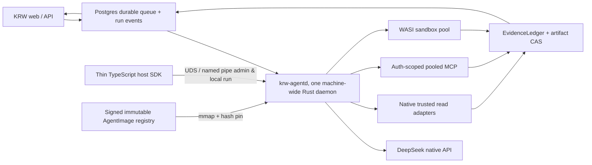
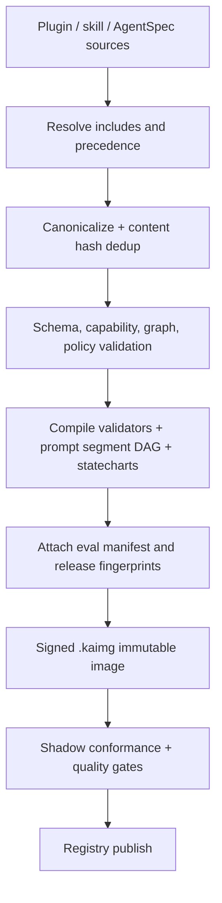

# KRW Embedded Agent 최종 아키텍처

> **SUPERSEDED — 역사적 아키텍처 검토**
>
> 이 문서는 주요 경계와 불변조건을 도출한 설계 기록이다. 이후 사용자는 직접 작성한 AgentSpec,
> DeepSeek-only Rust runtime, 기존 Python MCP 유지, legacy importer/runtime 없음, 별도 rollback 계획 없음,
> 변경 시점에만 compile하는 방향을 최종 권한으로 정했다. 현행 구현 기준은
> [`IMPLEMENTATION_STATUS.md`](./IMPLEMENTATION_STATUS.md)다. 상충하는 importer, TypeScript fallback,
> legacy migration/rollback, 단계별 승인 문구는 적용하지 않는다.
>
> **출력 계약 정정 (2026-08-04):** `company_research`의 정상 final은 AnswerIR-first가 아니라
> Flash의 direct Korean Markdown이다. kernel-owned EvidenceLedger hash/ID receipt를 그 Markdown과
> 같은 atomic final에 묶는다. 아래의 AnswerIR-first 본문은 당시의 선택 기록이며, typed product
> contract 외의 현재 normal research output을 다시 AnswerIR로 되돌리는 근거가 아니다.

작성일: 2026-08-02  
상태: 역사적 참고 자료  
범위: DeepSeek-only, read-heavy KRW research agent, 한 머신의 대량 session

## 1. 최종 판정

최종 production 형태는 **machine-wide Rust agent daemon + immutable AgentImage + thin TypeScript
host SDK**로 한다.

이 결정에서 “에이전트 내장형”은 plugin process를 daemon 안에 억지로 넣는다는 뜻이 아니다.
plugin의 prompt, workflow, tool contract, evidence rule, memory rule, verifier, budget을 build/startup 때
하나의 `AgentImage`로 컴파일하고, runtime kernel이 그것을 자신의 판단 상태로 직접 실행한다는 뜻이다.

확정 항목:

- model provider는 DeepSeek만 사용한다.
- model/tool call마다 Claude Code, Node, Python subprocess를 만들지 않는다.
- 한 OS user/deployment에는 **active leader daemon 하나**만 둔다. supervisor와 fencing으로
  이중 기동을 막고, singleton을 고가용성 수단으로 오해하지 않는다.
- queued/idle session은 DB에만 존재한다.
- active run만 작은 `RunContext`를 가진다.
- 고빈도 trusted read tool은 native Rust adapter다.
- 원격 도구는 auth-scope가 분리된 pooled MCP connection을 쓴다.
- 비신뢰 로컬 확장은 필요할 때만 lazy-start하는 shared WASI sandbox sidecar를 사용한다.
- 일반 agent는 typed evidence-first ReAct, gap DAG, best-first action selection을 사용한다.
- MCTS/LATS, generic Reflexion, multi-persona debate는 기본 runtime에 넣지 않는다.
- 현재 TypeScript/Agent SDK 경로는 migration baseline으로만 사용하고 제거한다.
- TypeScript direct-DeepSeek reference interpreter는 동일 contract를 실행할 수 있는 배포 가능한
  비교군/비상 fallback으로 유지한다. steady-state production process에는 상주시키지 않는다.

제품 성공은 다음 세 조건을 동시에 만족하는 것이다.

1. 현재 답변 품질, citation, 숫자 정확도, Guru 계약이 떨어지지 않는다.
2. 같은 머신에서 process-tree RSS, tail latency, sustained throughput이 개선된다.
3. `Capability ABI` 안의 새로운 read-only plugin/MCP capability를 kernel 수정 없이 AgentImage로
   추가할 수 있다. 새 auth/evidence semantics처럼 ABI 밖의 기능은 kernel release가 필요하다고
   명시한다.

한 조건의 개선으로 다른 조건의 퇴행을 상쇄하지 않는다.

## 2. 왜 plugin 실행형과 내장형이 다른가

| 항목 | plugin 실행형 | AgentImage 내장형 |
|---|---|---|
| agent가 보는 것 | tool 이름과 설명 | goal, capability, evidence rule, stop rule까지 포함된 상태 공간 |
| 시작 비용 | manifest/skill parse, process 또는 connection 준비 | 검증된 image mmap + shared pointer |
| 호출 비용 | shell/interpreter/process 또는 반복 schema parse | native call, pooled MCP, 또는 warm WASM instance |
| 자율성 | model이 prompt를 읽고 임의로 조합 | model이 제안하고 kernel이 typed DAG와 policy로 판단/검증 |
| 품질 경계 | prompt 문구에 의존 | deterministic validator, EvidenceLedger, ClaimManifest |
| session memory | transcript 중심 | typed memory + evidence IDs + unresolved goals |
| hot reload | 실행 중 내용 변경 가능 | 새 immutable hash, active run은 old image에 pin |
| 격리 | process 단위가 흔함 | native trusted, MCP auth scope, WASM sandbox로 등급화 |
| 확장성 | 실행기는 단순하지만 품질 규칙이 흩어짐 | compile contract가 강하고 runtime 판단과 직접 결합 |

현재 KRW plugin은 이미 단순 command 모음이 아니다. `SearchPlan v2`, `ResearchState v2`,
bounded autonomy, period policy, strong-claim boundary, Guru sealed workflow, answer composer가 있다.
이 의미를 prompt 파일로만 둘 이유가 없다. runtime의 typed state로 올리는 것이 맞다.

## 3. Claw Code에서 가져올 것과 버릴 것

공개 소스는 참고할 수 있지만 Claude Code 내부 유출물이라고 판정할 근거는 없다. 현재 공개 README는
Anthropic과 무관한 Rust implementation이며 production project가 아니라고 밝힌다.

가져올 패턴:

- provider/tool/session/permission의 명시적 interface
- deterministic mock parity harness
- session/tool pair 보존
- MCP lifecycle과 health state
- CLI doctor와 conformance test

버릴 패턴:

- external plugin tool 호출마다 child process spawn
- model iteration마다 전체 session clone
- 여러 tool call의 무조건 순차 실행
- 일반 transcript summary만으로 장기 memory를 처리
- 범용 Claude Code parity를 제품 목표로 삼는 것

KRW runtime은 범용 coding agent가 아니다. domain research state가 훨씬 작고 강하다. 따라서 Claw를
fork하지 않고, 공개 protocol과 KRW 계약으로 새 kernel을 만든다. 상세 소스 점검은
[`SIMULATION_REPORT.md`](SIMULATION_REPORT.md)에 있다.

## 4. 전체 topology



compile-time과 runtime dependency를 ASCII로 줄이면 다음과 같다.

```text
AgentSpec + schemas + fixtures
            |
            v
       AgentImage ---------------> krw-agentd
                                      |   |   |
KRW web/API -> agent_v1 DB ABI <------+   |   +-> DeepSeek native API
                  |                       |
                  +-> durable events      +-> native / pooled MCP / optional WASI
                                                |
                                                v
                                      EvidenceLedger -> AnswerIR -> atomic final
```

steady state에서 agent 전용 Node worker는 없다. web/API는 queue와 user-facing SSE를 유지하고,
daemon은 최소 권한 DB role로 **versioned stored-procedure ABI만 호출**해 claim, checkpoint, event,
final commit을 처리한다. arbitrary SQL과 table write 권한은 없다. TypeScript SDK는 local admin,
test, migration/fallback을 위한 얇은 client이며 scheduling/fencing/commit 권한을 소유하지 않는다.

IPC는 session execution의 source of truth가 아니다. DB가 durable source of truth다. host가 죽어도
daemon run이 고아가 되지 않는다. OS supervisor가 daemon을 restart/backoff하고, DB advisory lock과
fencing으로 한 machine generation의 active leader 하나만 허용한다.

### 4.1 Daemon lifecycle

- launchd/systemd가 crash-loop exponential backoff와 restart budget을 소유한다.
- startup은 DB ABI, image registry, secrets, DeepSeek contract probe, required capability readiness를
  통과하기 전까지 ready가 아니다.
- 새 generation은 socket/DB leader lock을 얻은 뒤 old generation의 claim을 빼앗지 않고 drain한다.
- SIGTERM은 새 claim 중단 → active safe-boundary checkpoint → deadline 후 cancel 순서다.
- duplicate daemon, stale socket, leader lease loss, version skew는 named error와 operator recovery를 가진다.
- availability 목표는 bounded restart/recovery time으로 정의하고 singleton 자체를 reliability로 세지 않는다.

## 5. 저장소 구조

예정 구조:

```text
krw-agnet/
  Cargo.toml
  crates/
    agent-kernel/          # run/cognitive/action state machines
    agent-image/           # AgentSpec parser, compiler, manifest/blob reader
    deepseek-wire/         # native HTTP/SSE, exact thinking/tool replay
    evidence/              # ResearchGraph, EvidenceLedger, ClaimManifest
    scheduler/             # admission, DRR, permits, pressure governor, optional DRF
    persistence/           # Postgres claim/fencing/events/outbox/artifact metadata
    tool-core/             # trusted KRW native read adapters
    tool-mcp/              # MCP pool, health, auth isolation, circuit breakers
    tool-wasi/             # optional lazy WASI sidecar protocol/client
    memory/                # session memory, compaction, prompt segment graph
    protocol/              # typed IPC/admin/event schemas
    telemetry/             # metrics, traces, redaction
  bins/
    krw-agentd/            # production daemon
    krw-agent/             # single documented operator/authoring CLI
    krw-agentc/            # internal compiler implementation; not a second primary UX
  packages/
    host-ts/               # thin UDS/named-pipe client and app adapter
    reference-ts/          # deployable comparison/fallback direct DeepSeek interpreter
  agents/
    krw-ontology/          # AgentSpec sources and compatibility adapter
    krw-guru/              # Guru workflows and verifier policies
  schemas/
    agent-spec/
    agent-image/
    baseline/
    trace-policy/
    run-events/
    checkpoints/
  fixtures/
    deepseek/
    mcp/
    crash/
    sessions/
  evals/
    fixed-50q/
    guru-30q/
    long-session/
    mutation/
  docs/
```

crate boundary는 compilation unit을 늘리기 위한 장식이 아니다. `agent-kernel`이 provider, DB,
MCP implementation을 import하지 않도록 dependency direction을 고정한다.

## 6. AgentSpec과 AgentImage

### 6.1 Source contract

현재 `.claude-plugin`, `.codex-plugin`, Codex skill package를 compatibility input으로 읽되 내부 표준은
`AgentSpec` 하나다.

```yaml
agent:
  id: krw-ontology-research
  version: 1.0.0
  run_kinds: [research, news, market_move]

roles:
  - planner
  - actor
  - composer
  - verifier

capabilities:
  - id: ontology.query_context
    binding: mcp://krw-ontology/query_context
    permission: read
    auth_scope: tenant
    parallel_safe: true
    idempotency: canonical_args
    cache: evidence_only

workflows:
  research: workflows/research.statechart.yaml

policies:
  evidence: policies/research-state-v2.yaml
  memory: policies/session-memory-v1.yaml
  output: policies/korean-investor-answer.yaml

evals:
  - evals/fixed-50q.yaml
```

source는 사람이 편집할 수 있는 Markdown/YAML/JSON으로 유지한다. runtime은 source를 직접 읽지 않는다.

### 6.2 Capability ABI v1

AgentImage가 확장할 수 있는 경계를 과장하지 않는다. kernel 수정 없이 추가 가능한 capability는
다음 ABI를 모두 만족해야 한다.

```text
CapabilityDescriptorV1
  stable capability ID + schema version
  MCP/protocol version + canonical input/output schema hashes
  server build ID + evidence-data release hash
  canonical input schema + bounded typed output envelope
  read/write class, determinism, idempotency key policy
  principal/auth scope + credential version
  parallel/retry/cache/singleflight policy
  latency/result-byte/memory/cost estimates and hard limits
  EvidenceRecord mapping + source/directness/period/unit semantics
  versioned error taxonomy + redaction/retention policy
  compatibility and deprecation window
```

- AgentImage는 이 ABI 안에서 workflow, prompt, validator, budget과 capability binding을 조합한다.
- 새로운 auth model, side effect class, evidence primitive, host import 또는 validator instruction은
  ABI 확장과 kernel release가 필요하다.
- production canary 전에 서로 다른 작성자가 만든 native read, pooled MCP, declarative transform
  capability 세 개가 core 수정 없이 compile/conformance를 통과해야 한다.
- 대표 read-only plugin의 95% 미만을 arbitrary escape hook 없이 표현하면 AgentImage 설계를 중단한다.
- claim snapshot, action, EvidenceRecord가 위 contract/data hashes를 모두 pin하며 active run 중 mismatch가
  생기면 pool을 폐기하고 해당 action을 실행하지 않는다.

### 6.3 Compile pipeline



compiler가 거절해야 하는 것:

- capability conflict 또는 ambiguous precedence
- unknown tool/model/role
- graph cycle 또는 unreachable terminal state
- root 밖 include/symlink/path traversal
- unsupported JSON Schema feature
- permission/auth scope 누락
- output claim인데 evidence verifier가 없음
- mutable remote include 또는 unpinned artifact
- eval manifest가 없는 production image

### 6.4 Image layout

`.kaimg`는 versioned OCI-style artifact다. source of truth가 아니라 rebuildable release artifact다.

```text
manifest.json, RFC 8785 canonical JSON
  format/compiler/min-kernel versions
  image/source hashes, signature, release fingerprint
  prompt segment DAG and blob hashes
  role/workflow statecharts
  capability graph and compact tool IDs
  validator/evidence/memory/budget/error/eval descriptors
blobs/sha256/*
  prompt/reference text, schemas, fixtures, compiled validator tables
```

manifest는 작고 한 번만 parse한다. 큰 immutable blob만 mmap하며 text/schema는 content hash로
dedup한다. 이 방식은 Rust와 TypeScript가 같은 artifact를 읽고 diff/doctor하기 쉽다. FlatBuffers나
archived binary index는 image parse가 실제 startup/RSS 병목으로 측정될 때만 추가한다. hot path가 아닌
작은 manifest를 위해 binary ABI를 먼저 만들지 않는다. image는 secret을 포함하지 않는다.

### 6.5 Runtime sharing

- daemon은 image hash별 `Arc<AgentImageView>` 하나만 유지한다.
- active run은 pointer와 compact numeric IDs만 가진다.
- prompt/reference text는 hash dedup하고 중복 allocate하지 않는다.
- hot reload는 새 hash를 publish하고 atomic registry pointer를 바꾼다.
- in-flight run만 시작한 image hash에 pin된다. idle session은 image에 pin하지 않는다.
- old image는 마지막 pinned run 종료 후 unmap한다.
- image/protocol/DB ABI artifact는 compatible lease/checkpoint가 하나라도 남아 있으면 제거하지 않는다.
  세 번째 incompatible rollout은 old run을 명시적으로 drain/cancel하거나 migration을 완료하기 전 차단한다.

## 7. Agent kernel

### 7.1 Durable execution state

```text
QUEUED
  -> CLAIMED
  -> ADMITTED
  -> RUNNING
  -> VERIFYING
  -> COMMITTING
  -> SUCCEEDED

Any non-terminal state
  -> RETRY_WAIT | DEGRADED | CANCELLING | FAILED
```

모든 transition은 `(run_id, seq, fencing_token, image_hash, runtime_version)`과 함께 append한다.
old fencing token의 write는 DB에서 거절한다.

### 7.2 Cognitive state

execution state와 별개로 아래를 checkpoint한다.

```text
LOAD
  -> ROUTE
  -> PLAN
  -> ACT
  -> EXECUTE
  -> INGEST
  -> ASSESS
       -> ACT       positive-value gap remains
       -> REPLAN    new material gap, image-policy bounded delta-replan
       -> DRAFT     enough evidence or no useful continuation
  -> LOCAL_VERIFY
       -> SEMANTIC_VERIFY   risk gate only
       -> RETRIEVE          one precise gap only
       -> REPAIR            exact issue list, max 1
  -> LOCAL_VERIFY
  -> COMMIT
```

model은 plan/action/draft를 제안한다. kernel은 capability, graph, permission, budget, evidence,
termination을 결정한다. 자율성은 높지만 권한과 사실 경계를 model text에 맡기지 않는다. replan/repair
기본 횟수는 signed image policy가 정하고 kernel은 안전 hard ceiling만 강제한다. 변경은 equal-budget
품질 gate를 통과해야 한다.

### 7.3 Action state

```text
PROPOSED -> AUTHORIZED -> LEASED -> DISPATCHED -> OBSERVED -> COMMITTED
```

- `action_key = run + goal + tool + canonical_args + auth_scope + release_fingerprint`
- 같은 key의 committed result가 있으면 재사용한다.
- ambiguous side effect는 blind retry하지 않는다.
- read-only idempotent action만 policy에 따라 retry한다.
- `begin_action`은 dispatch 전에 provider episode/tool-call ID, canonical args/payload hash,
  capability/input/output schema/data release hashes, fence, checkpoint seq, mutation ID를 원자 저장한다.
- 같은 mutation ID와 payload hash의 RPC retry는 기존 receipt를 반환하고, payload가 다르면 거절한다.
- 향후 write capability는 remote idempotency와 completion lookup이 둘 다 없으면 automatic retry/replan을
  금지한다.

### 7.4 Process 없는 logical actors

`planner`, `actor`, `composer`, `verifier`, `guru_evidence_child`는 process가 아니다.

```text
invoke_role(role_id, input_refs, allowed_capabilities, inherited_budget)
  -> structured role result
```

- actor는 selected goals와 relevant evidence digest만 받는다.
- actor끼리 자연어 대화하지 않는다.
- communication은 immutable EvidenceLedger delta로만 한다.
- 종료 후 free-form transcript를 보존하지 않는다.
- 일반 research는 child actor 없이 DAG parallelism을 우선한다.
- Guru child는 parent reservation 안에서 bounded task로 실행한다.

## 8. 자율성 알고리즘

### 8.1 ResearchGraph

`GoalNode`는 생각 조각이 아니라 검증할 evidence obligation이다.

```text
GoalNode
  id
  kind: qualitative | metric | news | filing | interpretation
  required, weight, dependencies
  directness requirement
  entity/ticker/period/calculation constraints
  status: unresolved | partial | satisfied | blocked
  evidence IDs, calculation IDs
```

- simple lookup은 router가 1-node graph를 만든다.
- 일반 filing research는 SearchPlan v2를 graph로 compile한다.
- `ResearchState v2.recommended_actions`와 missing clauses가 frontier를 갱신한다.
- Guru sealed question은 1~3 atomic goal로 제한한다.
- replan은 기존 node를 수정하지 않고 versioned delta node를 append한다.

### 8.2 Evidence-first constrained ReAct

ReAct의 observation-adaptive 장점은 유지하되 free-form tool loop를 제거한다.

```text
route -> typed goals -> shortlist capabilities -> model proposes calls
-> kernel validates -> independent reads run in parallel
-> ledger ingest -> goal status update -> stop or next precise gap
```

tool 호출이 없는 simple answer는 planner model call을 생략한다. workflow가 이미 deterministic
SearchPlan을 만들 수 있으면 별도 planner call도 생략한다.

### 8.3 Best-first gap selection

초기에는 information gain이라고 부르지 않는다. 확률 calibration 전에는 expected marginal
coverage value다.

```text
U(state) = weighted covered obligation ratio
           - contradiction penalty
           - unresolved scope penalty

Score(action | state) =
    conservative_expected_delta_utility
  - latency_weight * expected_p95_latency
  - token_weight * expected_tokens
  - tool_cost_weight * expected_tool_cost
  - byte_weight * expected_result_bytes
  - overlap_weight * expected_duplicate_evidence
  - risk_weight * execution_risk
```

`strong_claim_allowed`, personal-data boundary, Guru seal은 penalty가 아니라 hard constraint다.

초기 expected delta는 model confidence가 아니라 다음 deterministic feature로 계산한다.

- required unresolved goal인지
- `recommended_actions`에 있는지
- direct evidence ceiling을 올리는지
- calculation coverage를 채우는지
- 기존 evidence와 canonical key가 중복되는지
- tool의 historical latency/failure/result-byte profile

충분한 labeled trace가 생긴 뒤에만 calibrated estimator를 실험한다. production score는 optimistic
UCB가 아니라 uncertainty를 빼는 conservative lower estimate를 쓴다.

### 8.4 Parallel batch

다음이 모두 참인 action만 같이 실행한다.

- dependency가 없다.
- read-only다.
- manifest에 `parallel_safe=true`다.
- auth scope가 정확히 분리된다.
- expected overlap이 낮다.
- model/tool/memory permits가 있다.
- parent deadline과 budget 안에 있다.

tool 결과는 병렬로 받아도 original tool-call order로 provider message에 넣는다.

### 8.5 Stop rules

다음 중 하나면 검색을 멈춘다.

- 모든 load-bearing required goal이 satisfied다.
- requested calculation axes가 covered다.
- partial answer가 가능하고 남은 gap이 결론을 바꾸지 못한다.
- 다음 action score가 `<= 0`이다.
- 같은 gap signature 또는 utility 정체가 2회 연속이다.
- 남은 gap이 unavailable external data에 의존한다.
- hard deadline/token/tool/byte budget이 끝났다.

끝났다는 이유로 unsupported strong claim을 만들지 않는다. partial/blocked state는 answer strength를
낮추거나 gap을 명시한다.

### 8.6 Reflection and repair

generic “다시 생각해”는 금지한다. reflection은 외부에서 위치가 특정된 오류에만 허용한다.

trigger:

- tool schema violation
- ResearchState material gap
- deterministic verifier issue
- contradiction
- no-progress twice

repair action은 `remove`, `downgrade`, `recalculate`, `retrieve_precise_gap` 중 하나다. 한 번 repair한 뒤
deterministic verifier를 다시 통과해야 한다. cross-session 자연어 reflection memory는 저장하지 않는다.

### 8.7 채택/거절 registry

| 전략 | 결정 | 조건 |
|---|---|---|
| typed ReAct | 채택 | 모든 run |
| evidence-goal DAG | 채택 | simple lookup은 1 node |
| best-first gap | 채택 | deterministic score부터 시작 |
| beam width 2 | 실험 | ambiguous hard slice, equal-budget 우위 필요 |
| MCTS/LATS | 거절 | cheap faithful simulator와 calibrated value 없음 |
| ToT/GoT | 거절 | domain evidence graph보다 비용 대비 근거 약함 |
| generic Reflexion | 거절 | exact external feedback repair만 허용 |
| multi-agent debate | 거절 | same-model correlated cost, equal-budget 우위 없음 |
| contextual bandit | 제한 | preapproved macro-policy selection만 |

MCTS는 cached faithful simulator, actual outcome replay, calibrated value, zero extra external calls,
equal-budget Pareto 우위를 모두 확보한 뒤 offline plan search에서만 재검토한다.

### 8.8 Safe macro-policy selection

production에서 bandit이 고를 수 있는 것은 사전에 gate를 통과한 macro-policy뿐이다.

허용 예:

- planner skip vs typed planner
- verifier tier
- DeepSeek effort high vs max
- flash vs pro, 각 run kind gate 통과 후
- safe parallel width

금지:

- permission, auth, capability allowlist
- evidence/directness threshold
- personal-data policy
- hard budget
- Guru sealed workflow
- unapproved model/image/prompt

online exploration은 하지 않는다. offline logged-policy evaluation, shadow, tiny canary, frozen baseline
fallback 순서를 지킨다.

## 9. Evidence architecture

### 9.1 EvidenceLedger

tool output은 transcript text가 아니라 typed evidence로 ingest한다.

```text
EvidenceRecord
  evidence_id, content_hash
  source/tool/release/auth scope
  entity, period, as_of, units
  directness, evidence grade
  payload_ref, normalized facts
  supports/refutes/qualifies edges
```

- raw payload는 bounded artifact CAS에 저장한다.
- ledger는 immutable append + supersession edge다.
- model이 만든 prose는 evidence가 아니다.
- personal evidence는 public cache/singleflight와 절대 합치지 않는다.

### 9.2 AnswerIR와 ClaimManifest

Markdown을 먼저 만든 뒤 span hash를 붙이는 post-hoc 검증은 금지한다. composer는 먼저 typed
`AnswerIR`를 만들고, deterministic validator가 이를 통과시킨 뒤 마지막에 Markdown으로 render한다.

```text
AnswerIR
  sections[]
    intent, ordering, disclosed uncertainty
  claims[]
    claim_id
    kind: fact | number | interpretation | uncertainty
    goal_ids
    evidence_ids
    subject, predicate, value, unit, period, comparison basis
    strength: strong | qualified
  calculations[]
    expression, inputs, output, unit, rounding

AnswerBundle
  answer_ir_hash
  deterministic Markdown rendering
  rendered claim anchors/text span hashes
```

deterministic verifier가 검사할 것:

- evidence ID가 현재 image/release/auth scope ledger에 존재
- 숫자, 통화, 단위, 기간, ticker가 evidence/calculation과 일치
- direct-required claim이 strong-claim-ready
- partial/not-answerable을 strong prose로 승격하지 않음
- Guru seal과 company evidence context hash 일치
- internal tool/mode/budget/error language leak 0
- renderer가 IR 밖의 숫자/날짜/강한 사실을 만들지 않음
- rendered claim anchor와 IR/evidence/calculation lineage가 일치

자유형 인사말과 연결 문장은 제한된 renderer slot에서만 허용한다. causal/비교/수치 주장은 반드시
IR slot을 가져야 한다. semantic verifier는 독립 defect detector이지 entailment의 증명으로 세지 않는다.

### 9.3 Adaptive semantic verifier

deterministic checks는 모든 run에서 실행한다. DeepSeek semantic verifier는 다음 risk gate에서 실행한다.

- Guru/company judgment
- numeric, comparison, causal claim
- contradictory sources
- partial state인데 assertive draft
- relevant memory가 compacted됨
- image/model/release fingerprint 변경
- personal-data boundary
- mutation-suite OOD detector

verifier는 actor reasoning을 보지 않고 normalized evidence와 draft만 본다. 새 사실/tool call을 만들 수
없으며 `claim_id`, issue type, exact remedy만 반환한다.

## 10. Tool execution tiers

### Tier 0. Declarative capability

대부분의 plugin은 code가 아니다. prompt, workflow, schemas, policy, query template, validator를
AgentImage에 compile한다. runtime process 0, connection 0이다.

### Tier 1. Native trusted core

고빈도 KRW read tool을 Rust trait adapter로 구현한다.

- zero shell/interpreter spawn
- generated validators
- direct typed result
- bounded streaming parser
- explicit resource/latency estimate
- panic boundary와 circuit breaker

native adapter는 trusted signed release에만 포함한다. third-party code를 native로 로드하지 않는다.

### Tier 2. Pooled MCP

remote/domain service는 MCP를 유지한다.

pool key:

```text
server + transport + agent image + release fingerprint + auth principal/scope
```

- schema/readiness handshake는 release fingerprint 단위로 cache한다.
- personal/public pool, cache, singleflight를 분리한다.
- server별 semaphore, timeout, retry, circuit breaker를 둔다.
- idle LRU eviction과 hard connection cap을 둔다.
- DeepSeek에 MCP block을 보내지 않고 kernel이 실행 후 일반 tool result로 변환한다.

### Tier 3. WASI component

새로운 로컬 transform이나 third-party extension은 optional shared WASI sidecar에서 실행한다.

- preopened directory 없음이 기본
- network 없음이 기본
- fuel, epoch timeout, linear memory cap
- host capability import allowlist
- daemon 기본 binary는 WASM engine을 load하지 않는다.
- 첫 WASI capability가 필요할 때 machine-wide sidecar 하나를 lazy start하고 warm instance pool을
  plugin/auth scope별 bounded하게 유지한다.
- panic/trap은 daemon을 죽이지 않음

read-heavy 현재 plugin은 Tier 0/1/2로 충분하다. WASI는 기본 RSS에 비용을 더하지 않는 확장성
escape hatch다. MCP capability의 native 승격은 기존 sidecar를 실제 제거할 수 있고 동일 topology
end-to-end p95 또는 process-tree PSS가 사전 고정한 최소 10% 이상 개선될 때만 허용한다.

## 11. DeepSeek wire contract

### 11.1 API

- native Chat Completions endpoint `https://api.deepseek.com`을 직접 사용한다.
- generic OpenAI/Anthropic SDK 대신 작은 direct HTTP/SSE client를 구현한다.
- production model name은 local whitelist로 제한한다.
- unknown alias는 startup에서 거절한다. silent flash mapping을 허용하지 않는다.
- 현행 물리 model은 `deepseek-v4-flash` 하나이고 실행 policy는 `flash_high`, `flash_max`,
  `flash_direct` profile로만 구분한다.
- model name은 AgentImage가 아니라 signed deployment model registry에 둔다.

### 11.2 Thinking/tool replay

- `ProviderEpisodeV1`은 model/API version, ordered assistant content, exact `reasoning_content`, tool calls,
  call IDs, tool results, tool-schema/image hashes를 opaque durable block으로 보존한다.
- 같은 provider episode를 계속할 때 current tool lineage를 semantic byte-equivalent ordering으로 완전히
  replay한다. 일부 reasoning/tool block만 요약·삭제·재직렬화하지 않는다.
- compaction은 old episode를 이어 붙이지 않는다. 완결 turn의 validated typed memory, final AnswerIR,
  evidence refs로 **새 provider conversation/episode**를 시작한다.
- assistant tool block을 durable checkpoint하기 전에 tool을 dispatch하지 않는다. 해당 checkpoint 전후
  kill/restart를 Phase 1 crash matrix에 넣는다.
- SSE keep-alive comment와 empty line을 정상 처리한다.
- incomplete UTF-8/JSON/tool args는 incremental parser state로 보존한다.

### 11.3 Retry

| status/point | retry |
|---|---|
| 400/401/402/422 | 없음, actionable fail |
| 429/500/503 before token | bounded full-jitter retry |
| transport error before token | bounded retry |
| partial reasoning/text only | partial 폐기, budget 내 step restart |
| tool action dispatched | ledger 확인 전 retry 금지 |
| final commit ack loss | DB idempotent readback |

### 11.4 Prefix/cache

DeepSeek cache는 exact prefix best-effort다.

prompt order:

```text
stable kernel/product policy
-> stable AgentImage workflow/role/tool schemas
-> stable session memory headers
-> retrieved evidence digest
-> recent turns
-> current user input
```

stable segment hash가 바뀌지 않도록 tool schema ordering과 JSON canonicalization을 고정한다.
`prompt_cache_hit_tokens`, miss tokens, prefix hash를 기록한다.

### 11.5 Model policy

품질 우선 초기 deployment policy 후보:

- composer, Guru, high-risk verifier: `flash_max`
- actor/planner: `flash_high`
- trivial deterministic router: model call 생략
- direct model decision이 필요한 저위험 분류: `flash_direct`

이 값은 kernel 상수가 아니라 signed deployment policy다. 같은 DeepSeek self-judge만으로 선택하지
않고, 동일 budget의 paired evaluation으로 run kind마다 고정한다.

### 11.6 Provider compatibility and degraded mode

- 첫 수직 slice에서 no-tool, thinking+tool, fragmented SSE, partial stream, error별 redacted golden
  wire fixture를 캡처한다.
- pinned model alias별 live compatibility probe를 매일 별도 낮은 budget으로 실행한다.
- contract drift가 감지되면 새 claim을 멈추고 current step은 safe boundary에서 종료한다.
- 429/503 burst는 provider bucket과 soft concurrency를 낮추고 ETA가 있는 queue 상태를 반환한다.
- retry budget을 소진하면 resumable provider-unavailable state로 남기며 다른 provider로 silent fallback하지 않는다.
- input/output/reasoning token과 KRW 비용은 run/tenant/day hard cap을 모두 가진다.

## 12. Session memory와 context

### 12.1 Four tiers

| tier | 내용 | residency |
|---|---|---|
| L0 | current DeepSeek tool lineage, active buffers | active turn RAM |
| L1 | recent complete turns | bounded RAM/request segments |
| L2 | typed SessionMemoryV1, goals, decisions, evidence refs | DB + small retrieved view |
| L3 | raw transcript/tool payload/artifacts | DB/object/CAS only |

`SessionMemoryV1`:

- entities/tickers
- user scope and constraints
- period/as-of
- resolved decisions and superseded links
- unresolved questions/goals
- evidence IDs and source message IDs
- answer strength/uncertainty

자연어 chain-of-thought와 generic reflection은 저장하지 않는다.
session memory schema는 image-independent하고 versioned다. 다음 turn에서 deterministic migration을
적용하며 실패하면 old memory를 보존하고 run을 시작하지 않는다.

### 12.2 Compaction

- complete user-turn boundary에서만 수행한다.
- active tool-use/result/reasoning lineage를 절대 자르지 않는다.
- number, period, negation, user constraint, evidence ID는 exact validator로 검사한다.
- 새 summary가 source에 없는 fact를 추가하면 실패한다.
- old fact는 삭제하지 않고 `superseded_by`로 연결한다.
- summary 실패 시 raw recent window를 유지한다.
- question-conditioned retrieval로 관련 memory만 load한다.

### 12.3 Buffer discipline

- whole transcript vector clone 금지
- prompt segment graph를 streaming serializer가 직접 읽음
- tool raw result는 threshold 초과 시 즉시 CAS spool
- `Bytes`/shared immutable slices로 전달
- active turn별 bounded arena는 turn 종료 시 한번에 해제
- bounded channel만 허용
- queued/idle session별 task/timer/listener 0
- deadline은 shared timer wheel/min-heap 하나로 관리

## 13. Scheduler와 capacity

### 13.1 Resource vector

run/job estimate:

```text
memory bytes
model stream slots
provider request/token buckets
expected input/output tokens
tool server slots by server
artifact spool bytes
cost budget
deadline/priority
```

historical EWMA/p95로 estimate하고 unknown은 보수적 profile을 사용한다. underestimate가 반복되면
profile을 자동 상향한다.

### 13.2 Hierarchy

bootstrap hierarchy:

```text
interactive | background | shadow priority class
-> global/tenant queue cap + deadline/cost admission
-> per-tenant concurrency/spend cap
-> user weighted DRR
-> session FIFO, active turn 1
-> provider RPM/TPM + step-level model/tool/memory permits
```

admission은 `admit | defer_with_eta | degrade | reject` 중 하나를 typed reason과 함께 반환한다. 무한
대기는 허용하지 않고 deadline 안에 시작할 수 없는 작업은 즉시 defer/reject한다. interactive reserve는
idle일 때 background가 빌린다. background aging은 starvation을 막되 hard resource cap을 넘지 않는다.

DRF는 처음부터 production 기본값으로 두지 않는다. trace replay에서 특정 tenant가 model, MCP,
memory 중 dominant resource를 실제로 독점하고, DRF가 위 baseline보다 fairness를 개선하면서
fragmentation/throughput 손실이 5% 이하일 때 admission plugin으로 승격한다.

### 13.3 Permit lifecycle

- model request 직전에 model permit 획득, stream 종료/중단 즉시 반납
- tool execution 직전에 해당 server permit 획득, 완료 즉시 반납
- model과 tool permit을 phase 사이에서 같이 보유하지 않음
- memory reservation은 active buffers가 해제될 때까지 유지
- child actor는 parent budget/reservation을 분할, 별도 무제한 run 아님

### 13.4 Adaptive concurrency

hard provider RPM/TPM/spend token bucket과 provider가 관측한 concurrency ceiling을 먼저 적용한다.
그 아래 soft concurrency limit은 latency-gradient controller로 천천히 조정한다.

```text
gradient = clamp(long_term_latency / current_latency, 0.5, 1.0)
next = smooth(current * gradient + safe_queue_allowance)
```

429, 503, RSS red pressure, repeated MCP failure에는 즉시 multiplicative decrease한다. provider,
MCP server, WASM pool마다 controller를 따로 둔다. hard max는 절대 넘지 않는다.

PID 하나로 모든 resource를 조절하지 않는다. model/tool latency는 delayed, bursty, heterogeneous다.

### 13.5 Initial low-spec profiles

실측 전 conservative bootstrap:

| host | model streams | total tool slots | Guru active | cache cap |
|---|---:|---:|---:|---:|
| 2 vCPU / 4GB | 2 | 4 | 1 | 64 MiB |
| 4 vCPU / 8GB | 4 | 8 | 2 | 128 MiB |
| 8+ vCPU / 16GB | 8 | 16 | 4 | 256 MiB |

이 값은 promise가 아니다. Phase 0 live replay 후 profile artifact로 version한다.

### 13.6 Memory pressure states

| state | action |
|---|---|
| green | normal work-conserving scheduling |
| amber | speculative/beam off, cache eviction, lower parallel width |
| red | new background claim stop, soft permits decrease, spool earlier |
| critical | all claim stop, safe-boundary background cancel, drain/restart alert |

OS/container available memory와 daemon RSS/PSS를 본다. Rust heap만 보면 mmap, TLS, socket buffer를 놓친다.

## 14. Persistence와 exactly-once visible outcome

`agent-kernel`은 Postgres와 SQL을 모른다. 다음 transport-neutral port만 의존한다.

```text
PersistencePort
  claim, renew, checkpoint
  begin_action, observe_action, finalize_action(accepted|rejected, validation_receipt, policy_receipt)
  commit_final, fail_or_defer, request_cancel, readback
```

`krw-agentd`의 Postgres adapter는 `agent_v1.*` stored procedure에만 매핑한다. daemon DB role은
schema/table의 SELECT/INSERT/UPDATE/DELETE 권한이 없고 해당 함수의 `EXECUTE`만 가진다. 모든 함수는
tenant, fence, monotonic seq, image/runtime version을 검증하고 필요한 transaction을 내부에서 끝낸다.
daemon과 schema는 동결된 단일 ABI만 지원한다. 호환용 action commit 경로나 receipt 없는 승인 상태는
두지 않으며, schema와 daemon artifact를 같은 release fingerprint로 함께 승격한다.

### 14.1 DB contract

`claim_agent_run`은 run ID만 반환하지 않는다.

```text
run_id, session_id, tenant_id
fencing_token, lease_deadline
run_version, cancel_generation
agent_image_hash, runtime_version
priority, resource_profile, budgets
checkpoint_seq, request contract
```

claim receipt에는 user/assistant message IDs, immutable user input/history refs, reserved budget receipt,
product/run kind, ontology/data release, response locale를 함께 snapshot한다. daemon이 이후 live product
table을 조합해 다른 시점의 state를 읽지 않는다.

예정 tables/columns:

- `agent_runs`: image/runtime/fence/cognitive state/resource profile
- `agent_run_events`: append-only typed events, unique run+seq+fence
- `agent_actions`: unique action key, dispatch/observation/result hash
- `agent_checkpoints`: state snapshots and artifact refs
- `agent_artifacts`: CAS metadata, scope, retention
- `agent_outbox`: final event/billing/notification delivery

예정 procedure surface:

```text
agent_v1.claim_run
agent_v1.renew_lease
agent_v1.append_events_and_checkpoint
agent_v1.begin_action
agent_v1.observe_action
agent_v1.finalize_action
agent_v1.commit_final
agent_v1.fail_or_defer
agent_v1.request_cancel
agent_v1.read_committed_outcome
```

procedure signature와 result schema는 contract fixture로 고정하고 Rust/TypeScript reference가 같은
fixture를 실행한다. daemon 내부에 product table 이름이나 billing SQL이 나타나면 dependency test를
실패시킨다.

### 14.2 Commit

final visible result는 한 DB transaction에서 처리한다.

- assistant message content/status와 final AnswerBundle/AnswerIR hash
- citations/evidence/claim/presentation refs
- run terminal status
- usage totals
- reserved budget settlement 또는 release와 usage ledger
- terminal event, validated renderer fragments, billing/notification outbox rows

billing/notification consumer는 idempotency key로 처리한다. completion callback의 persistence failure를
삼키지 않는다. web/API는 committed result와 outbox만 읽고 daemon의 중간 buffer를 source로 삼지 않는다.

### 14.3 Cancellation linearization

- `request_cancel`은 `cancel_generation/run_version`을 단조 증가시키고 cancellation outbox를 원자 저장한다.
- `commit_final`은 fence, expected run version, cancel generation, mutation ID를 모두 compare-and-set한다.
- final transaction이 먼저 commit되면 뒤의 cancel은 terminal no-op이다.
- cancel transaction이 먼저 commit되면 final은 content/citation/settlement을 쓰지 못하고 예약을 release한다.
- cancel/final 동시성, ack loss, daemon kill의 모든 interleaving을 model-based DB test로 탐색한다.

### 14.4 DB loss

- checkpoint/event intent를 persist하지 못하면 다음 model/tool step으로 진행하지 않는다.
- partial stream buffer는 hard cap을 가진다.
- DB outage가 cap/deadline을 넘으면 provider stream을 cancel하고 recoverable state로 남긴다.
- local spool은 telemetry에만 사용하고 authoritative run state를 이중화하지 않는다.

### 14.5 Crash recovery

- new daemon이 expired lease를 새 fencing token으로 claim한다.
- last committed cognitive/action state에서 재개한다.
- partial model output은 commit하지 않는다.
- action ledger가 ambiguous이면 automatic retry 대신 verifier/replan으로 보낸다.
- run당 visible final, settlement, terminal event는 각각 최대 1개다.

## 15. Security boundary

- image/source에 API key, MCP token, user PII를 넣지 않는다.
- secrets는 OS keychain/secret manager에서 handle로 주입한다.
- DeepSeek `user_id`는 versioned HMAC pseudonym을 사용하고 PII를 넣지 않는다.
- capability는 signed image allowlist와 runtime permission이 모두 허용해야 노출된다.
- tool output은 instruction이 아니라 untrusted data/evidence로 표시한다.
- prompt injection text가 capability, budget, auth scope를 바꿀 수 없다.
- personal pool/cache/singleflight/artifact는 principal scope를 key에 포함한다.
- native tool은 trusted monorepo code만 허용한다.
- third-party local code는 WASI sandbox 밖으로 나올 수 없다.
- logs/SSE에 reasoning, raw secret, personal raw tool result를 노출하지 않는다.
- debug bundle은 redacted hashes, state transitions, timing, sizes만 기본 포함한다.
- UDS/named pipe는 OS user ACL, peer credential, nonce-bound protocol handshake를 모두 검증한다.
- protocol/image ABI는 current/previous 두 generation만 허용하고 downgrade replay를 거절한다.
- image signing root와 online signing key를 분리하며 rotate/revoke/expiry/offline-registry 절차를 둔다.
- revoked image는 새 run에 load하지 않고 이미 실행 중인 run은 severity policy에 따라 drain 또는 cancel한다.
- CAS는 global/tenant/run byte quota, TTL, principal scope, encryption, deletion tombstone과 vacuum SLO를 가진다.
- personal artifact 삭제 요청은 cache/singleflight/pinned snapshot까지 lineage로 찾아 bounded time 안에 제거한다.

## 16. Observability

모든 metric은 model/image/runtime/release fingerprint를 가진다.

필수:

- queue/admission/step wait p50/p95/p99
- model TTFT, total latency, tokens/s, cache hit/miss tokens
- tool server latency/error/breaker/pool wait
- daemon RSS/PSS/USS, heap/mmap, buffer/spool bytes
- active task/channel/timer/FD/socket counts
- evidence coverage delta per action
- duplicate/zero-value action rate
- verifier trigger/issue/false-edit/repair outcome
- claim/evidence linkage and citation accuracy
- per-tenant dominant share, max background wait, Jain fairness
- retry/cancel/crash/recovery reason

trace에는 raw prompt/response 대신 segment/evidence hashes와 safe metadata를 기본 사용한다.

## 17. 현재 앱과의 migration seam

현재 앱의 재사용 대상:

- durable queue and DB notification
- user-facing SSE/event persistence
- cancel and run ownership
- billing reservation/settlement contract
- evidence/citation presentation
- fixed 50Q, Guru, runner contract tests

교체 대상:

- `src/lib/agent/runner.ts`의 Agent SDK query/tool loop
- session resume가 Claude local transcript에 의존하는 부분
- `src/lib/agent/job-runner.ts`의 free-form stream callback/persistence path
- `src/worker/agent-supervisor.ts`의 FIFO/concurrency-only claim loop
- repeated plugin/skill/tool schema assembly

새 typed seam:

```text
RunRequest
  run/session/tenant IDs
  image hash and run kind
  user input/history refs
  deadline/budgets/priority
  idempotency/fence

RunEvent
  state | safe_progress | tool_status | evidence_delta
  validated_answer_delta
  usage | checkpoint | warning | final | failed
```

SSE byte stream을 host에서 다시 해석하지 않는다. daemon이 typed event를 DB에 쓰고 web layer가 기존
user-facing protocol로 render한다. model의 raw draft/text delta는 public event나 DB user stream에
쓰지 않는다. AnswerIR와 evidence validation이 끝난 뒤 `commit_final`이 AnswerBundle과 deterministic
renderer fragment outbox를 함께 commit한다. consumer는 그 후에만 `validated_answer_delta`를 내보낸다.
재접속의 authoritative answer는 항상 committed AnswerBundle이다.

### 17.1 Developer experience contract

runtime의 첫 사용과 plugin authoring은 부가 문서가 아니라 release contract다. 사용자-facing command는
`krw-agent` 하나로 통일하고, daemon/compiler binary는 내부 implementation detail로 둔다.

```text
keyless first result:
  krw-agent quickstart --fixture vertical-slice
  -> 2 vCPU / 4 GB, installed CLI 기준 p95 <= 120초
  -> validated AnswerBundle + citation + img_/run_/trace IDs

representative embedded plugin:
  plugin new -> edit AgentSpec -> check -> image build -> plugin test -> replay
  -> clean checkout 기준 median <= 30분
  -> kernel Rust code/process/raw SQL 수정 0
```

keyless quickstart는 pinned fake provider, fixture MCP, disposable local Postgres를 사용하고 fixture임을
명시한다. live DeepSeek/MCP readiness는 secret을 출력하지 않는 `krw-agent doctor --live`로 분리한다.
모든 command는 stable `--json`, documented exit code, prefixed resource ID, redacted debug bundle을 제공한다.
상세 journey, 오류 형식, upgrade flow와 시간 측정 기준은
[`DEVELOPER_EXPERIENCE.md`](DEVELOPER_EXPERIENCE.md)가 canonical이다.

## 18. 구현 phases

최종 architecture는 목적지일 뿐 선행 가정이 아니다. 가장 위험한 integration을 먼저 관통하고,
그 결과가 architecture를 반증할 수 있게 순서를 둔다.

### Phase 0. Baseline freeze와 contract extraction

- 실제 통합 앱 commit, DB migration head, plugin release를 hash로 pin
- `TracePolicyV1` allowlist를 먼저 승인한 뒤 production-like workload를 정규화/익명화해 고정
- 같은 credential/account를 사용하는 agent, LLM gateway, filing brief 등 모든 DeepSeek route를 inventory하고
  daemon permit 공유 또는 account quota partition을 확정
- legacy process-tree RSS/latency/quality/cost baseline
- prompt/tool/session/evidence/Guru behavioral contract fixtures
- crash/fencing/commit invariant spec
- keyless quickstart fixture와 supported 2 vCPU/4 GB profile freeze
- first helpful result의 start/end와 p50/p95, embedded plugin의 human/CI stopwatch 기준 pre-register
- primary/secondary quality endpoint, hard gate, paired analysis, power/sample size를 pre-register. release
  primary/critical quality margin은 이미 `0`으로 고정하며 auxiliary endpoint margin은 release 판정을 완화하지 않음
- Rust/TS promotion threshold와 workload topology를 candidate 결과 보기 전에 freeze. 문서의 75%/60%/10ms를
  default fixed threshold로 사용하고 변경은 candidate build 전 별도 사용자 재승인이 필요

Phase 0 artifact는 RFC 8785 canonical JSON `BaselineManifestV1`과 content-addressed blobs다.

```text
BaselineManifestV1
  schema/version + created_by + approval receipt
  app commit + DB migration + AgentSpec/plugin/image release pins
  DeepSeek model/API probe + all-account-route inventory hash
  tool protocol/schema/server-build/data-release pins
  TracePolicyV1 + sanitized workload/fixture hashes + scan/deletion receipt
  supported hardware/OS/topology + collector versions
  endpoint formulas + zero-margin release gates + power/sample/seeds
  fixed Rust/TS/DX thresholds
  signature + immutable registry/CAS references
```

`TracePolicyV1`은 permitted field만 복사한다. raw prompt/response, credential, personal identifier, free-form
tool payload는 baseline artifact에 넣지 않는다. user/tenant key는 project-scoped HMAC으로 pseudonymize하고
timestamp는 필요한 bucket으로 낮춘다. event-level sanitized trace는 encrypted at rest, maintainer-only ACL,
30-day TTL과 deletion lineage를 가진다. 장기 보존은 aggregate histogram, approved synthetic/redacted fixture,
content hash뿐이다. allowlist validator, secret/PII scanner, injected-canary 100% detection, zero high-severity finding,
deletion drill이 모두 통과해야 freeze할 수 있다.

Exit: `krw-agent baseline verify baseline/phase0.json --offline`이 schema, hashes, signatures, scan/deletion
receipt, endpoint formula, fixed threshold를 모두 검증하고 signed approval receipt를 출력한다. 구현 전에는
동일 schema의 hand-validated fixture로 contract를 고정한다.

### Phase 1. Architecture-killing vertical slice

- hand-authored 최소 pinned image 하나와 `Capability ABI v1`
- `krw-agent quickstart --fixture vertical-slice`와 disposable production-shaped local contract profile
- `DB claim -> DeepSeek thinking/tool -> representative MCP read -> AnswerIR`
- exact `ProviderEpisodeV1` checkpoint -> action receipt -> MCP result -> fresh/continued lineage replay
- AnswerIR 검증 -> atomic final/message/budget/outbox -> committed renderer SSE
- cancellation과 provider/MCP/DB 각 crash point recovery
- concurrent cancel vs final의 모든 linearization
- `agent_v1` stored-procedure ABI와 EXECUTE-only DB role
- 같은 contract를 실행하는 deployable TypeScript reference slice
- live redacted DeepSeek wire fixture와 daily compatibility probe
- idle/1/4/8 active process-tree PSS/USS, page faults, TTFT, quality paired replay

Exit: keyless quickstart p95 120초 이하, raw draft 공개 0, stale/duplicate action 0,
cancel/final 이중 outcome 0, atomic product settlement,
quality/crash/persistence invariant가 통과하고 Rust가 pre-registered threshold에서 TS comparison을
이길 가능성이 남는다. 실패하면 compiler/scheduler 일반화를 시작하지 않는다. 원인을 계측한 두 번의
bounded optimization cycle 뒤에도 threshold를 못 넘으면 Rust rollout을 중단하고 TS reference 유지 또는
architecture 변경을 다시 승인받는다.

### Phase 2. AgentSpec/Image foundation

- compatibility importer for current KRW skills/plugins
- canonical include/hash/dedup/precedence
- statechart, capability graph, validator compiler
- canonical manifest/blob image, signer/revocation, reader, doctor
- native/MCP/declarative 세 capability의 independent-author conformance
- `plugin new/check/test`, semantic image diff, copy/paste recovery와 representative timed authoring journey
- current/previous image and protocol ABI compatibility
- N -> N+2 rollout, rollback, revoked image, long-idle session memory migration

Exit: representative read-only plugins 95% 이상을 arbitrary escape hook과 core 수정 없이 표현하고,
semantic hash/diff/rollback을 재현한다. clean checkout에서 대표 MCP plugin의 human walkthrough median이
30분 이하고 generated-template automated path가 CI에서 재현된다.

### Phase 3. Full kernel, evidence and tools

- durable/cognitive/action state machines 전체
- ResearchGraph, EvidenceLedger, ClaimManifest
- typed AnswerIR와 deterministic renderer
- native tool adapter interface
- pooled MCP with auth isolation
- CAS/spool and deterministic verifier
- safe independent parallel execution
- tiered session memory/compaction과 bounded buffers

Exit: ResearchState v2 and citation/evidence contract parity.

### Phase 4. Capacity and durability hardening

- stored-procedure ABI migration/upgrade/fencing/atomic final hardening
- `doctor`, redacted `debug-bundle`, migration inspect/apply/rollback과 error runbook hardening
- queue/deadline/cost admission, provider RPM/TPM, DRR and phase permits
- pressure governor, timer wheel, cancellation
- tenant/global caps, ETA/reject/degrade behavior
- 10k/100k queued, CAS quota/TTL/deletion, crash matrix
- DRF는 trace가 필요를 증명하고 baseline 대비 fairness gain/손실 gate를 통과할 때만 추가

Exit: 2vCPU/4GB profile load/soak gates.

### Phase 5. App shadow integration

- thin TypeScript SDK/admin
- current app에 versioned DB ABI와 typed event/SSE adapter 연결
- legacy vs candidate shadow with separate permits/budget
- session sticky runtime/image assignment
- eligible legacy session rehydrate, in-flight turn migration 금지

Exit: normal research shadow non-inferiority.

### Phase 6. Run-kind canary

순서:

1. no-tool/simple
2. general research
3. news/market move
4. earnings/scenario/idea
5. Guru

각 run kind는 별도 quality/performance gate를 통과해야 한다. fail 시 그 slice만 legacy로 유지한다.

### Phase 7. WASI and ecosystem hardening

- 실제 ABI 밖 local extension 수요가 확인된 경우에만 WASI component SDK/template
- WASI-specific doctor/conformance/migration; 기본 read-only plugin DX는 Phase 2에서 이미 종료
- hot image publish/drain/rollback
- macOS/Linux arm64/x64 packages, named pipe contract for Windows

Exit: 실제 수요가 확인된 WASI extension도 core 수정 없이 authoring/conformance/security gate를 통과한다.

### Phase 8. Legacy removal

- Agent SDK/Claude executable/ccSwitch runtime dependency 제거
- validated current/previous daemon and image 두 버전 유지
- 7-day soak 후 legacy DB/session fields cleanup

Exit: production only path가 `krw-agentd`이며 rollback은 previous validated daemon/image다.

## 19. Test plan

### 19.1 Unit/property/fuzz

- AgentSpec/image parser and schema evolution
- graph cycle/dependency/termination
- canonical hash/cache/singleflight keys
- prompt segment ordering and no-clone serializers
- SSE fragmented UTF-8/JSON/keepalive/tool args
- `ProviderEpisodeV1` exact reasoning/tool lineage replay and fresh-conversation compaction
- public event에 raw draft delta가 없고 committed renderer fragment만 존재
- DRF/DRR invariants and starvation aging
- byte/memory accounting overflow
- permission/auth scope matrix
- ClaimManifest numeric/date/unit/ticker mutations
- Capability/MCP protocol+schema+build+data release hash mismatch
- DB procedure replay: same mutation/same payload, same mutation/different payload

### 19.2 Model-based state tests

모든 transition에서 kill/restart를 삽입한다.

- provider before/after first token
- tool parse/authorize/dispatch/observe/commit
- checkpoint before/after
- final compose/commit/ack
- DB/MCP/provider disconnect
- duplicate daemon/expired lease/stale fence
- concurrent cancel/final/ack-loss transaction interleavings
- provider tool block checkpoint 전후 kill과 action dispatch receipt 전후 kill
- N -> N+2 image/protocol/DB ABI rollout, rollback, revoked image, session memory migration

invariant: stale write 0, duplicate final 0, double billing 0, blind side-effect retry 0.

### 19.3 Differential tests

- same AgentSpec and fixture
- TypeScript reference vs Rust daemon event trace
- stable semantic events compare, timing/random IDs normalize
- cold/warm cache 분리
- same DeepSeek fingerprint and equal token/tool budgets

### 19.4 Quality eval

- fixed 50Q and Guru 30Q는 fast regression smoke이며 최종 통계 표본으로 과장하지 않음
- normal/news/market/earnings/scenario/idea slices
- 1/12/50 turn memory tests
- citation precision/recall/entailment
- numeric/calculation/period mutation suite
- personal-data boundary
- internal wording leak
- human blind holdout
- AnswerIR에서 rendered Markdown까지 claim omission/invention mutation

Phase 0에서 metric별 baseline variance와 paired correlation을 측정한 뒤 표본 크기를 고정한다.

- primary: blind human/contract composite의 paired delta; session/run-kind로 stratify하고 paired bootstrap
  one-sided 95% lower confidence bound를 사용
- power: release margin은 `0`으로 유지한다. 기대 true improvement `delta_pass > 0`일 때
  `LCB >= 0`을 통과할 power와, 별도 negative `delta_detect` regression을 탐지할 power를 모두 90%로
  맞추도록 holdout을 계산한다. 필요한 표본이 현실적으로 불가능하면 gate를 완화하지 않고 hold한다.
- hard endpoints: citation entailment, numeric/period correctness, personal boundary, Guru seal, unsupported
  strong claim은 aggregate로 상쇄하지 않고 각각 exact gate
- tuning set과 final holdout을 분리하고 결과 확인 후 rubric/zero margin/sample을 바꾸지 않음
- same-model judge는 triage만 하고 human/contract disagreement에서 우선하지 않음

### 19.5 Performance/load

- idle, 1/2/4/8/16/32 active
- 10k/100k queued
- noisy tenant + interactive burst replay
- 100KB/256KB/1MB tool outputs
- warm/cold AgentImage and MCP pools
- 6-hour and 7-day soak
- repeated hot reload and crash/restart
- provider RPM/TPM exhaustion, tenant/global queue cap, deadline rejection/degrade
- CAS disk-full/quota/TTL/delete/vacuum and image registry offline/revocation

## 20. Release gates

### Quality

- critical/security/evidence regression 0
- release primary paired quality delta의 non-inferiority margin은 `0`으로 고정하고 one-sided 95% lower
  bound `>= 0`; Phase 0은 endpoint/formula/power를 정할 뿐 이 margin을 완화하지 않음
- citation, numeric, period, personal boundary, Guru 각각 비열등
- unsupported strong claim, cross-scope leakage, Guru seal violation은 1건도 허용하지 않음
- human blind holdout가 same-model judge와 충돌하면 human/contract gate 우선
- auxiliary noisy endpoint에 별도 descriptive margin을 쓰더라도 primary/critical release gate를 상쇄하지 않음
- zero-margin power가 현실적으로 확보되지 않거나 uncertainty/data shortage가 있으면 pass가 아니라 hold 후 재승인

### Performance

- end-to-end p50/p95와 TTFT 비열등
- sustained throughput/jobs per minute 비열등
- process-tree PSS/USS/RSS가 legacy보다 큰 폭으로 개선
- Rust daemon process-tree footprint가 동일 기능 TS reference의 `<= 75%`, active-run memory slope가
  `<= 60%`여야 함. Phase 0 측정이 이 threshold의 불가능성을 보이면 구현 전에 다시 승인받음
- daemon scheduling/IPC overhead p95 `<= 10ms`, provider/queue 제외
- idle daemon RSS 목표 `<= 64 MiB`, release topology 실측
- 10k queued heap/RSS delta `<= 5 MiB`, 100k `<= 10 MiB`
- active run retained memory가 profile hard limit 안에서 선형
- unbounded FD/task/timer/channel growth 0
- native capability 승격은 해당 MCP/sidecar 제거 후 end-to-end p95 또는 PSS가 `>= 10%` 개선

### Fairness/reliability

- background starvation 0
- max queue wait SLO and interactive reserve 통과
- stale fence acceptance 0
- duplicate final/billing/outbox 0
- 7-day soak leak 0
- rollback drill 통과
- duplicate daemon/leader loss/UDS auth/image revoke/DB ABI rolling upgrade drill 통과
- DRF를 켠 경우 baseline 대비 throughput/fragmentation 손실 `<= 5%`이고 fairness SLO가 개선

Rust가 Node reference를 의미 있게 이기지 못하면 production Rust rollout을 중단한다. architecture
문서는 최종 방향을 제시하지만, 근거 없는 언어 신앙을 release하지 않는다.

## 21. Error registry

| code | 의미 | recovery | user/operator output |
|---|---|---|---|
| KAI-1001 | image signature/hash invalid | load 거절 | image rebuild/publish command |
| KAI-1002 | image/kernel schema incompatible | old image 유지 | compatible compiler/runtime 안내 |
| KDS-2001 | invalid DeepSeek model alias | startup fail | allowed model list |
| KDS-2002 | reasoning/tool lineage invalid | step fail, no retry | trace ID and replay fix |
| KDS-2429 | account/user concurrency exceeded | queue + governor decrease | retry ETA, no provider switch |
| KTL-3001 | capability denied | action reject | required capability/policy |
| KTL-3002 | personal auth scope mismatch | pool discard | reauthenticate, no fallback |
| KTL-3003 | ambiguous tool completion | automatic retry 금지 | operator/replan state |
| KPS-4001 | stale fencing token | write reject | reclaim/reload checkpoint |
| KPS-4002 | checkpoint persistence failed | next step stop | DB recovery instructions |
| KEV-5001 | unsupported strong claim | downgrade/remove | verifier issue list |
| KEV-5002 | numeric/period mismatch | recalculate | exact claim/evidence IDs |
| KSC-6001 | memory red pressure | claims stop/degrade | profile and active buffers |
| KDX-7001 | local contract dependency unavailable | quickstart rollback/cleanup | exact prerequisite or bundled-profile fix |
| KDX-7002 | plugin conformance failed | image publish 차단 | failing contract, expected/actual, copy/paste check |
| KDX-7003 | unsafe automatic repair requested | `--fix` 거절 | dry-run manual recovery and risk explanation |

모든 error는 problem, cause, safe next action, docs link, trace ID를 가진다. secret/raw personal payload는
포함하지 않는다.

### 21.1 Failure-mode and rescue registry

| failure mode | detection | bounded behavior | rescue proof |
|---|---|---|---|
| DeepSeek contract drift | daily redacted golden probe | affected model/run kind admission stop | pinned fixture replay + explicit re-enable |
| provider/MCP timeout storm | breaker, permit wait, error-rate window | AIMD decrease, deadline-aware partial/reject | recovery ramp without retry burst |
| daemon duplicate/crash loop | peer credential, leader fence, supervisor budget | one leader, claims stop after budget | old fence write 0 and bounded restart |
| DB loss during action/final | procedure failure before next transition | no blind dispatch, no public draft | receipt/readback or safe terminal failure |
| CAS full/corrupt | quota/hash/readback | large ingest stop, existing evidence immutable | quota cleanup/tombstone/hash drill |
| image revoke/version skew | signature/revocation/ABI check | new claim stop, safe in-flight drain policy | previous validated image rollback |
| memory red pressure | PSS/buffer/permit thresholds | admission stop, compaction/degrade, bounded cancel | no OOM and no retained-session slope |
| auth-scope mismatch | pool/cache key invariant | action reject, never cross-user fallback | isolation mutation suite |
| verifier false edit | mutation suite and correct→wrong metric | remove/downgrade-only repair | deterministic revalidation |
| local onboarding failure | quickstart/doctor timed fixture | cleanup disposable resources, actionable code | clean-machine rerun under 120초 |

## 22. Decision registry

| decision | 선택 | 이유 | 반증 조건 |
|---|---|---|---|
| production topology | machine-wide Rust daemon | machine-level sharing, bounded memory, no host duplication | Node reference 대비 측정 우위 없음 |
| persistence boundary | Rust PersistencePort -> versioned stored-procedure ABI | no arbitrary SQL, DB-enforced fence/atomicity, no steady Node worker | ABI/DB overhead SLO 실패 |
| host integration | thin TS SDK/admin only | current UI/API reuse without second runtime authority | translation/ops contract 실패 |
| plugin model | compiled AgentImage | semantic integration and startup/memory sharing | conformance/authoring DX 실패 |
| extension boundary | Capability ABI v1 | honest kernel-free plugin scope | representative plugin coverage <95% |
| image format | canonical JSON manifest + hashed blobs | portable, diffable, one-time parse, large blob mmap | parse가 실측 병목이면 binary index 추가 |
| agent loop | evidence-first typed ReAct | current ResearchState와 직접 맞음 | equal-budget eval 열위 |
| search | best-first gap | low duplicate cost, adaptive | deterministic recommended order보다 열위 |
| MCTS | exclude | no faithful cheap simulator | 재검토 조건 모두 충족 |
| memory | typed tiered memory | evidence/user constraints 보존 | 50-turn mutation suite 실패 |
| scheduler baseline | queue/deadline caps + RPM/TPM + tenant caps + DRR | measured limits first, simple O(1) fairness | trace에서 dominant-resource unfairness 지속 |
| optional DRF | disabled until trace-gated | heterogeneous resource fairness only when proven | loss >5% or no fairness gain |
| tools | native/MCP/WASI tiers | speed, compatibility, isolation | per-tier benchmark/security failure |
| provider | DeepSeek native API | exact model/tool/reasoning control | official contract change |

## 23. NOT in scope

- Claude Code 전체 기능/parity 복제
- arbitrary shell/filesystem-write coding agent
- multi-provider failover
- process-per-agent/subagent
- user-visible chain-of-thought
- runtime-loaded native third-party dynamic libraries
- unbounded online self-improvement
- same-model debate를 품질 보장으로 간주

## 24. 구현 승인 gate

아직 source implementation은 시작하지 않는다. 이 문서와
[`SIMULATION_REPORT.md`](SIMULATION_REPORT.md)가 승인된 뒤 Phase 0만 시작한다.

승인되는 전제:

- 최종 production은 Rust machine-wide daemon
- plugin은 AgentImage로 semantic compile
- DeepSeek native direct API
- TypeScript는 host SDK와 배포 가능한 comparison/fallback reference만; steady-state worker는 없음
- daemon persistence는 versioned stored-procedure ABI만 사용
- high autonomy, deterministic capability/evidence/budget boundary
- quality non-inferiority가 모든 rollout의 hard gate

## 25. GSTACK review report

### 25.1 Review outcome

초기 draft는 세 관점 모두에서 그대로 구현하기에 `NO-GO`였다. 아래 blocking finding을 문서에 반영한
현재 판정은 **설계 승인과 Phase 0에 한한 CONDITIONAL GO**다. Phase 1 이후 generalization이나 production
rollout 승인이 아니다.

| review | completed evidence | initial verdict | blocking findings | resolution |
|---|---|---|---:|---|
| CEO/product | independent agent + independent Codex CLI | NO-GO | 7 | vertical slice 우선, stored-procedure ABI, AnswerIR, honest Capability ABI, simple scheduler, quotas, signing/revoke 반영 |
| Engineering | independent Codex CLI + direct current-app source audit; second agent voice timed out | NO-GO | 8 | exact ProviderEpisode, validated-only streaming, atomic product final, cancel linearization, action binding, MCP pins, image lifetime, shared provider inventory 반영 |
| DX | independent Codex CLI; second agent voice timed out | NO-GO | 7 | keyless 2-minute quickstart, local contract profile, single CLI, 30-minute plugin gate, doctor/runbook/timing을 Phase 0~2로 이동 |
| Design/UI | not run | N/A | 0 | backend/CLI/infra 계획이라 product UI review 대상 아님 |
| Autonomy algorithms | independent specialist analysis | conditional | 4 core additions | typed evidence DAG, EvidenceLedger, best-first, adaptive verifier 반영; unsupported tree search/reflection/debate 제외 |
| Final integration audit | independent agent after all edits | CONDITIONAL GO | 5 | baseline schema/verify, zero quality margin, fixed threshold authority, trace policy/security evidence 반영; credential rotation remains external |

timeout된 voice를 합의로 세지 않았다. 완료된 review finding은 모두 plan에 반영했지만 실제 성능, 품질,
DX 점수는 아직 구현과 실측 전이다.

### 25.2 Decision audit

| challenge | decision | plan change | verification |
|---|---|---|---|
| compiler를 먼저 만들면 가장 위험한 경로를 늦게 발견 | architecture-killing vertical slice first | Phase 1을 DB→DeepSeek→MCP→AnswerIR→atomic final로 재배치 | crash matrix + TS/Rust paired trace |
| daemon의 arbitrary SQL이 결합도와 권한을 확대 | versioned `agent_v1.*` procedure ABI | EXECUTE-only role와 `PersistencePort` | DB model/property tests |
| free-form Markdown 뒤 claim 추출은 proof가 아님 | AnswerIR first | deterministic validation/renderer/atomic outbox | mutation and public-draft-leak tests |
| DeepSeek thinking/tool replay가 일반 chat history와 다름 | `ProviderEpisodeV1` exact lineage | complete episode replay; compaction은 fresh conversation | 1/12/50-turn live/golden fixtures |
| singleton daemon이 memory를 줄이는 대신 blast radius를 키움 | supervisor/fencing/pressure governor | queue caps, bounded restart, one leader generation | duplicate/crash/OOM drills |
| DRF/MCTS/Reflexion은 복잡하지만 근거가 약함 | simple baseline, trace-gated promotion | DRR+AIMD 기본; advanced strategies deferred | equal-budget/equal-load falsification |
| plugin 확장성이 kernel escape hook으로 변질될 수 있음 | honest Capability ABI v1 | protocol/schema/build/data/auth/evidence pins | independent-author coverage >=95% |
| 좋은 architecture라도 처음 못 쓰면 채택 실패 | DX를 release contract로 승격 | keyless quickstart와 timed plugin journey를 Phase 1/2 exit로 이동 | p95 120초, median 30분 walkthrough |
| Phase 0 evidence가 prose면 결과 후 기준을 바꿀 수 있음 | signed `BaselineManifestV1` | trace policy, endpoint formulas, fixed thresholds, approval receipt를 canonical manifest로 고정 | offline verify + tamper/deletion tests |

### 25.3 Existing code: retain, extract, replace

| current asset | retain/extract | replace or constrain |
|---|---|---|
| `krw-ontology-front/src/lib/agent/runner.ts` | prompt/tool/Guru behavior fixtures와 TS comparison semantics | Agent SDK loop와 Claude transcript resume |
| `krw-ontology-front/src/lib/agent/job-runner.ts` | queue ownership, cancel, billing, presentation requirements | split best-effort callbacks; one atomic procedure transaction으로 통합 |
| `krw-ontology-front/src/lib/agent/mcp-client.ts` | protocol/schema/release readiness checks | per-host client lifecycle; auth-scoped Rust pool로 교체 |
| `krw-ontology-front/src/worker/agent-supervisor.ts` | operational metrics and claim intent | FIFO/concurrency-only resident Node worker |
| `krw-ontology` SearchPlan/ResearchState/Guru contracts | AgentSpec importer와 typed graph의 source contract | prompt-only enforcement와 duplicated schema assembly |
| existing DB queue/SSE/evidence UI | product-facing semantics와 migration fixtures | raw model delta persistence와 non-atomic terminal side effects |

### 25.4 Remaining conditions

1. Phase 0 실행 전 노출 가능성이 생긴 DeepSeek credential을 revoke/rotate하고 redacted scan을 남긴다.
2. 사용자가 이 architecture와 **Phase 0만** 승인한다.
3. Phase 0에서 actual workload/eval/DX/Rust threshold를 candidate 결과 전에 freeze한다.
4. Phase 1 vertical slice가 stop condition을 통과하기 전 compiler, full scheduler, WASI를 일반화하지 않는다.

현재 unresolved architecture choice는 없다. 남은 항목은 외부 security action과 empirical falsification이다.

## Sources

- [DeepSeek Models & Pricing](https://api-docs.deepseek.com/quick_start/pricing/)
- [DeepSeek Thinking Mode](https://api-docs.deepseek.com/guides/thinking_mode/)
- [DeepSeek Tool Calls](https://api-docs.deepseek.com/guides/tool_calls/)
- [DeepSeek Anthropic Compatibility](https://api-docs.deepseek.com/guides/anthropic_api/)
- [DeepSeek Context Caching](https://api-docs.deepseek.com/guides/kv_cache/)
- [DeepSeek Rate Limit & Isolation](https://api-docs.deepseek.com/quick_start/rate_limit/)
- [Dominant Resource Fairness paper](https://www2.eecs.berkeley.edu/Pubs/TechRpts/2011/EECS-2011-18.html)
- [Netflix Gradient2 adaptive concurrency implementation](https://github.com/Netflix/concurrency-limits/blob/master/concurrency-limits-core/src/main/java/com/netflix/concurrency/limits/limit/Gradient2Limit.java)
- [ReAct](https://arxiv.org/abs/2210.03629)
- [ReWOO](https://arxiv.org/abs/2305.18323)
- [Reflexion](https://arxiv.org/abs/2303.11366)
- [LATS](https://arxiv.org/abs/2310.04406)
- [Lost in the Middle](https://arxiv.org/abs/2307.03172)
